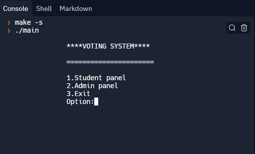

# Voting System Using C
A mini voting system using C Language  

## Screenshots

## Live Link
Click Here To View Live 

## Features
1. Allows us to set up a flexible and trustworthy voting system
2. Applicable for large as well as small group of people e.g. a batch, a class.
3. Keeps a record of  every voting process.
4. It has `Student Panel` and `Admin Panel`

## How To Run
- Keep all the files in same folder
- Then run `main.c` file on console
- Everything should go well
- To run on repl run click the run button
